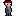
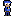

# **Darkest Times**

## _Game Design Document_

---

##### **Copyright notice / author information / boring legal stuff nobody likes**

David Medina Domínguez A01783155

Juan Pablo Cruz Rodriguez A01783208

Angel Adrian Afonso Castellanos A01782545

Daniel Soult Gómez A01782985

## _Index_

---

- [**Darkest Times**](#darkest-times)
  - [_Game Design Document_](#game-design-document)
        - [**Copyright notice / author information / boring legal stuff nobody likes**](#copyright-notice--author-information--boring-legal-stuff-nobody-likes)
  - [_Index_](#index)
  - [_Game Design_](#game-design)
    - [**Summary**](#summary)
        - [***Narrativa***](#narrativa)
      - [***Historia y Dialogos***](#historia-y-dialogos)
      - [***Personajes***](#personajes)
      - [***Generos***](#generos)
    - [**Gameplay**](#gameplay)
    - [**Mindset**](#mindset)
  - [_Technical_](#technical)
    - [**Screens**](#screens)
    - [**Controls**](#controls)
    - [**Mechanics**](#mechanics)
  - [_Level Design_](#level-design)
    - [**Themes**](#themes)
    - [**Game Flow**](#game-flow)
  - [_Development_](#development)
    - [**Abstract Classes / Components**](#abstract-classes--components)
    - [**Derived Classes / Component Compositions**](#derived-classes--component-compositions)
  - [_Graphics_](#graphics)
    - [**Style Attributes**](#style-attributes)
    - [**Graphics Needed**](#graphics-needed)
  - [_Sounds/Music_](#soundsmusic)
    - [**Style Attributes**](#style-attributes-1)
    - [**Sounds Needed**](#sounds-needed)
    - [**Music Needed**](#music-needed)
  - [_Schedule_](#schedule)

## _Game Design_

---

### **Summary**

##### ***Narrativa***

Eres ______ saliendo de tu trabajo en SCP Inc (Safe Control Places "Guiño a Special Contaiment Provedures"). De camino a la salida comienzas a sentir un ambiente inquietante y tenso. Comienzas a tambalearte, tienes nauseas y vas perdiendo tu consiencia. Luego, ves una puerta al final de un pasillo largo; decides atravesar la puerta de manera apresurada.

 No era lo que esperabas, ya que te encuentras en un es un espacio expansivo no euclidiano, que se asemeja a las habitaciones traseras de una tienda minorista. Todas las habitaciones en el Nivel 0 comparten las mismas características superficiales, como el papel tapiz monoamarillo gastado, la alfombra vieja y húmeda, los enchufes eléctricos dispersos y la iluminación fluorescente colocada de manera inconsistente. 

Preocupado y asustado empizas a buscar una salida, pero es en vano, ya que el espacio liminal en el que te encuentra es infinito. Sin embargo no todo es desesperacion, ya que encuntras una sala enorme con mas personas y tres puertas (dos puertas niveles y una puerta boss.). La sala esta marcada con el logo de tu empresa y encuentras varias notas de compañeros pasados que supuestamente habian despedido.

"Que esta ocurriendo"?
"Donde estoy"?
"Como salgo"?
Son las preguntas que te invaden la cabeza. Conforme avanzas en los diferentes escenarios, te vas dando cuenta del verdadero proposito de tu empresa SPC.

####  ***Historia y Dialogos***

1. Escenario 1(Epilogo) "Welcome to the #H$3@1?L#": 
   
-Al fin acabé con mi turno. (Expresa cansancio).

De pronto suena una radio que emite un mensaje únicamente para miembros de la empresa SCP (Safe Control Places: Empresa encargada de reducir accidentes de trabajo como una de seguridad industrial).

-A todos los trabajadores, por favor, regresar inmediatamente a su casa debido a una falla en el sistema. Deberán volver hasta nuevo aviso.

-No otra vez. Ya es la cuarta falla en este mes.

-Debo volver lo antes posible. Mi capibara (Zack) me está esperando. Debe estar hambriento y preocupado.

El jugador sale del cuarto principal y se dirige hacia la salida. Conforme el jugador avanza, el ambiente del lugar irá cambiando a la forma de un laberinto. Cada vez que se acerque a la puerta correcta, la atmósfera lo hará entrar en pánico (Los caminos tendrán un diseño glitcheado y tétrico).

-Vaya, no me acordaba de que este lugar tuviera tantos pasillos.
¿Desde cuándo las paredes son de color _____? Algo anda mal. (Se muestra preocupado).

Más adelante se encuentra con un cartel de publicidad de su compañía.

-SCP (Safe Control Places): La mejor decisión de tu vida. Desde que entré a esta empresa, no he vuelto a sonreír.

Luego encuentra otro cartel que indica que están reclutando personal.

-SCP te necesita. Llámanos ya. No entiendo por qué siguen reclutando a nuevo personal si ellos son los responsables de despedir a casi 10 trabajadores por mes.

-Pero, ¿qué...? ¿Dónde está la salida? (Se encuentra asustado y enojado).

El jugador se acerca al pasillo final, la música se apaga, la iluminación comienza a titilar y varios jumpscare aparecen para darle tensión al ambiente.

-¿Qué está sucediendo? (Se encuentra asustado).

Al frente aparece una persona sin cara, pero luego desaparece.

-¿Quién está ahí? (Se encuentra enojado, asustado y lo dice en tono agresivo).

-¿Quienquiera que esté haciendo esto, para de una maldita vez.

De pronto, la persona sin cara aparece detrás del jugador y comienza a perseguirlo mientras se escucha una música de fondo de miedo.

-¡Alto, alto, aléjate de mí! ¡No des un paso más! ¡ALTO!

-¡Ah! (De asombro y alivio). Ahí está la salida.

El jugador llega a la salida que lo llevará al siguiente escenario.

**Cierre del nivel**

**Dialogos de Interaccion**

- Creo que esta cerrada.
- Esta no es la salida.

1. Escenario 2(Lobby) "Welcome to the Back1200|\/|$":

#### ***Personajes***

Cada personaje interpretara un jugador relacionado al temas de los backrooms y spc: 

1.David->The Luckiest One (Cientifico)

2.Angel->The richest one (Ejecutivo)

3.Daniel->The fastest one (Mecanico o Plomero)

4.Juan->The rudest one (Guardia de seguridad)

Plan A: Los personajes contaran con un inicio y final distintos. Tambien contara con habilidades y stats diferentes.

Plan B:Los personajes contaran con habilidades y stats diferentes.

#### ***Generos***

Es un RPG (Role-Playing Game) que contiene elementos o generos como:

1. Plataformer: Este genero se presenta en la introduccion y desenlace de la historia.
   
2. Shooter: Este genero se encuentra en uno de los escenarios o espacios liminales.
   
3. Survival Horror: Este genero se encuentra en uno de los escenarios o espacios liminales.
   
4. Roguelike, Shooter, Survival RPG: Es el subgenero principal de nuestro videojuego. Se basa en mazmorras aleatorias con combate a larga distancia.

### **Gameplay**

What should the gameplay be like? 

El gameplay debe de contener elementos del RPG.

1. El jugador podra elegir entre cuatro personajes. Cada personaje tiene stats diferentes.

2. Narrativa: El jugador se imserse dentro de la historia. Desea conocer el origen del lugar.

3. Interaccion con el mundo: El jugador podra interactuar con los escenario, npc y objetos del juego.

4. Progresion de personaje: El jugador podra mejorar las stats del personaje equipandolo con mejores objetos o consumiendo varios consumibles.

What is the goal of the game, and what kind of obstacles are in the way?

La meta de juego es sobrevivir y escapar de los backrooms (en una cierta cantidad de tiempo o cronometro) utilizando las herremientas que se encuentran en los distintos escenarios. Debes de realizar varias misiones principales para recolectar varias llaves con las cuales podras abrir la puerta al boss final. 

Los obstaculos que se encuntran en nuestro videojuego son varios puzzles que se deben de resolver para abrir diferentes zonas. Luego, los principales obstaculos son los diferentes enemigos (fobias) y la oscuridad que intentara asesinar al jugador.

 What tactics should the player use to overcome them?

Sobrevivir, escapar, aprender, apostar y pelear de regreso son palabras clave a lo largo del desarrollo de la historia.  El jugador deberá utilizar todas las herramientas a su disposición para lograr sobrevivir, por lo que la escasez de estos, y la toma de decisiones del jugador a la hora de interactuar con el mundo repercutirán el desarrollo de la historia.

Dicho lo anterior, como queremos meter al jugador a un juego que no contiene tantos números y stats, para no desviarnos de la tensión y realidad, la ganancia de experiencia e incremento de nivel se hará de una forma escondida de segundo plano, pero de igual forma se le hara saber al jugador.

### **Mindset**

What kind of mindset do you want to provoke in the player? Do you want them to feel powerful, or weak? Adventurous, or nervous? Hurried, or calm? How do you intend to provoke those emotions?

El jugador se debe de sentir confundido, intrigado, atento, analítico, cuidadoso y aventurero pero con cierto nerviosismo.
Estas emociones se van a conseguir al poner el jugador en diferentes situaciones que implican su supervivencia, junto con el pensamiento de ahorro de recursos dado a que serán limitados.

A lo largo de la historia, existen dos caminos que puede tomar, por lo que en uno de ellos se va a sentir empoderado dado a que puede pelear en contra de los que lo quieren herir, mientras que en el otro se va a sentir totalmente en desventaja dado a que solo puede escapar y preocuparse de los recursos a sus disposición. 

## _Technical_

---

### **Screens**

1. Title Screen
   1. Nueva Partida
      1. Seleccionar entre cuatro personajes
      2. Salida de pestaña
   2. Cargar Partida
      1. Muestra las partidas creadas con anterioridad (max 3)
   3. Logros
      1. Muestra los logros que obtuvo el jugador
      2. Muestra los easter eggs que obtuvo
   4. Opciones
      1. General
      2. Video
      3. Brillo
      4. Sonido
      5. Controles 
      6. Lenguaje
   5. Creditos
   6. Salida del juego

2. Game Screen
   1. Menu de pausa 
   2. Inventario
   3. Mapa
   4. Pantalla de juego completado
   5. Pantalla de juego de "Game Over"

### **Controls**

How will the player interact with the game? Will they be able to choose the controls? What kind of in-game events are they going to be able to trigger, and how? (e.g. pressing buttons, opening doors, etc.)

Los controles van a cambiar dependiendo de la plataforma de videojuegos:

Pc:

    1. Movimento: w,a,s,d (Angel cree que es mejor con las flechas)
    2. Interactuar con objetos: e
    3. Abrir inventario: i
    4. Utilizar objeto o arma: click izquierdo
    5. Abrir mapa:m

### **Mechanics**

Are there any interesting mechanics? If so, how are you going to accomplish them? Physics, algorithms, etc.

**Debemos de dividir las mecanicas pasivas y activas para un mejor enfoque. Las pasivas son aquellas que se realizan automaticamente y las activas son expresadas a traves de los controle o teclas que debe de oprimir el jugador**

Las mecanicas que tenemos planteadas para nuestro videojuego son las siguientes: 

Movimiento basico: Tenemos planeado implementar el movimiento horizontal y vetical sobre un plano 2d. La mecanica se realizara con las w,a,s,d o con las flechas que se encunetran a mano derecha.

Movimiento avanzado: Tenemos planeado implementar la opcion de correr a traves de la tecla del "shift izquierdo". Esta mecanica le permitira al jugador evadir varios enemigos y moverse de manera rapida por el mapa.

Combate: Tenemos planeado implementar la mecanica de combate cuerpo a cuerpo y a distancia dependiendo de la arma que este utilizando el jugador en su momento. Esta mecanica se podra utilizar al oprimir el boton izquierdo del mouse. 

Interactuar: El jugador podra interactuar con el entorno y los distintos objetos consumibles a traves de la tecla E.

## _Level Design_

---

_(Note : These sections can safely be skipped if they&#39;re not relevant, or you&#39;d rather go about it another way. For most games, at least one of them should be useful. But I&#39;ll understand if you don&#39;t want to use them. It&#39;ll only hurt my feelings a little bit.)_

### **Themes**

En este apartado nos enfocamos en los diferentes niveles y las caracteristicas que cada uno posee:

1. Introduccion/Tutorial:
    1. Ambiente:
        1. Dark, calm, foreboding
     2. Objetos y elementos:
        1. _Ambient_
            1. Fireflies
            2. Beams of moonlight
            3. Tall grass
        2. _Interactive_
            1. Wolves
            2. Goblins
            3. Rocks
2. Hub Principal
    1. Ambiente:
        1. Dark, calm, foreboding
     2. Objetos y elementos:
        1. _Ambient_
            1. Fireflies
            2. Beams of moonlight
            3. Tall grass
        2. _Interactive_
            1. Wolves
            2. Goblins
            3. Rocks
3. Hospital
    1. Ambiente:
        1. Dangerous, tense, active
    2. Objetos y elementos:
        1. _Ambient_
            1. Rodents
            2. Torches
            3. Suits of armor
        2. _Interactive_
            1. Guards
            2. Giant rats
            3. Chests

4. Bosque
    1. Ambiente: 
        1. Dangerous, tense, active
    2. Objetos y elementos:
        1. _Ambient_
            1. Rodents
            2. Torches
            3. Suits of armor
        2. _Interactive_
            1. Guards
            2. Giant rats
            3. Chests

### **Game Flow**

Los pasos o estado los cuales el jugador va a vivir o tendra que experimentar. Basicamente, los pasos que debe de seguir para pasar el nivel:

1. Introduccion:
   1. El jugador inicia en el nivel introductorio.
   2. El juego se desplaza de la oficina principal y entra en un laberinto.
   3. Recorre los diferentes pasillos y habitaciones, mientras aprende los controles basicos.
   4. El jugador debe de encontrar e interactuar con diferentes elementos dentro del laberinto.
   5. Cerca de la salida el jugador vive la experiencia de ser perseguido por una especie de ente o criatura.
   6. El jugador alcanza la salida hacia el siguiente escenario.

2. Nivel de HUB:

## _Development_

---

### **Abstract Classes / Components**

En este apartado nos enfocamos en las diferentes clases u objetos/elementos que tendra nuestro videojuego:

1. Objetos Fisicos Vivientes:
    1. Jugador principal
    2. Jugadores no jugables (NPC)
    3. Enemigos (Phobias)
    4. Enemigos (Oscuridad)
2. Objetos Fisicos No Vivientes (Obstaculos):
   1. Muros
   2. Pisos
   3. Amoblados o elementos de estetica
   4. Plantas
   5. Puertas
   6. Ventanas
   7. Iluminacion (luces estaticas)
   8.  Utencilios o herramientas
3. Objetos Iteractivos o Especiales:
   1. Objetos Consumibles
   2. Dinero (Huesos)
   3. Armas de Fuego
   4. Armas de Luz
   5. Easter Eggs

_(example)_

### **Derived Classes / Component Compositions**

Las clases derivadas son aquellas que definen a nuestra clases principales a un nivel mucho mas especifico:

1. Jugador Principal
    1. PlayerMain
    2. PlayerUnlockable
2. Jugadores no jugables (NPC)
    1. EnemyWolf
    2. EnemyGoblin
    3. EnemyGuard (may drop key)
    4. EnemyGiantRat
    5. EnemyPrisoner
3. Enemigos (Phobias)
    1. ObjectRock (pick-up-able, throwable)
    2. ObjectChest (pick-up-able, throwable, spits gold coins with key)
    3. ObjectGoldCoin (cha-ching!)
    4. ObjectKey (pick-up-able, throwable)
4. Enemigos (Oscuridad)
    1. ObstacleWindow (destroyed with rock)
    2. ObstacleWall
    3. ObstacleGate (watches to see if certain buttons are pressed)
5. Muros
    1. InteractableButton
6. Pisos
7. Amoblados
8. Plantas
9. Puertas
10. Ventanas 
11. Iluminacion
12. Utencilios o Herramientas
13. Objetos Consumibles
14. Dinero
15. Armas de Fuego
16. Armas de Luz
17. Easter Eggs

_(example)_

## _Graphics_

2D con perspectiva desde arriba. El jugador utilizara una perspectiva top down , donde podra moverse de manera vertical y horizontal.

### **Style Attributes**

What kinds of colors will you be using? Do you have a limited palette to work with? A post-processed HSV map/image? Consistency is key for immersion.

Utilizaremos una paleta colores amplio. Sin embargo nos enfocaremos en colores oscuros u opacos para generar un ambiente tenso.

What kind of graphic style are you going for? Cartoony? Pixel-y? Cute? How, specifically? Solid, thick outlines with flat hues? Non-black outlines with limited tints/shades? Emphasize smooth curvatures over sharp angles? Describe a set of general rules depicting your style here.

El diseño de los personajes asi como el de los escenarios sera en pixel art (algunos dibujos estara dibijados en 16pixeles, 32pixeles o incluso mas para un mejor detalle).

La estetica que tendra los escenarios y los personajes mostrara una apariencia cansada, terrorifica, lastimada, abandonada, etc.

Well-designed feedback, both good (e.g. leveling up) and bad (e.g. being hit), are great for teaching the player how to play through trial and error, instead of scripting a lengthy tutorial. What kind of visual feedback are you going to use to let the player know they&#39;re interacting with something? That they \*can\* interact with something?

Cada elemento viviente tendra animaciones para cada accion como correr, atacar, ser golpeado, interactuar, etc.

Cada objeto consumible tendra cierta animacion o particulas para dar sensacion de que el objeto fue utilizado.

### **Graphics Needed**

1. Characters
    1. Human-like
        1. Goblin (idle, walking, throwing)
        2. Guard (idle, walking, stabbing)
        3. Prisoner (walking, running)
    2. Other
        1. Wolf (idle, walking, running)
        2. Giant Rat (idle, scurrying)
        3. Main character pet -> crown (just fly with him)
2. Blocks
    1. Dirt
    2. Dirt/Grass
    3. Stone Block
    4. Stone Bricks
    5. Tiled Floor
    6. Weathered Stone Block
    7. Weathered Stone Bricks
3. Ambient
    1. Tall Grass
    2. Rodent (idle, scurrying)
    3. Torch
    4. Armored Suit
    5. Chains (matching Weathered Stone Bricks)
    6. Blood stains (matching Weathered Stone Bricks)
4. Other
    1. Chest
    2. Door (matching Stone Bricks)
    3. Gate
    4. Button (matching Weathered Stone Bricks)

_(example)_

## _Sounds/Music_

---

### **Style Attributes**

Again, consistency is key. Define that consistency here. What kind of instruments do you want to use in your music? Any particular tempo, key? Influences, genre? Mood?

Stylistically, what kind of sound effects are you looking for? Do you want to exaggerate actions with lengthy, cartoony sounds (e.g. mario&#39;s jump), or use just enough to let the player know something happened (e.g. mega man&#39;s landing)? Going for realism? You can use the music style as a bit of a reference too.

 Remember, auditory feedback should stand out from the music and other sound effects so the player hears it well. Volume, panning, and frequency/pitch are all important aspects to consider in both music _and_ sounds - so plan accordingly!

### **Sounds Needed**

1. Effects
    1. Soft Footsteps (dirt floor)
    2. Sharper Footsteps (stone floor)
    3. Soft Landing (low vertical velocity)
    4. Hard Landing (high vertical velocity)
    5. Glass Breaking
    6. Chest Opening
    7. Door Opening
2. Feedback
    1. Relieved &quot;Ahhhh!&quot; (health)
    2. Shocked &quot;Ooomph!&quot; (attacked)
    3. Happy chime (extra life)
    4. Sad chime (died)

_(example)_

### **Music Needed**

1. Slow-paced, nerve-racking &quot;forest&quot; track
2. Exciting &quot;castle&quot; track
3. Creepy, slow &quot;dungeon&quot; track
4. Happy ending credits track
5. Rick Astley&#39;s hit #1 single &quot;Never Gonna Give You Up&quot;

_(example)_

## _Schedule_

Como hemos venido trabajando, no han sido fijadas fechas límite para tener secciones listas debido a que es necesaria la aprobación de ideas de los profesores para poder organizarnos y empezar a distruibuir la carga de trabajo entre nosotros.

_(define the main activities and the expected dates when they should be finished. This is only a reference, and can change as the project is developed)_

1. develop base classes
    1. base entity
        1. base player
        2. base enemy
        3. base block
  2. base app state
        1. game world
        2. menu world
2. develop player and basic block classes
    1. physics / collisions
3. find some smooth controls/physics
4. develop other derived classes
    1. blocks
        1. moving
        2. falling
        3. breaking
        4. cloud
    2. enemies
        1. soldier
        2. rat
        3. etc.
5. design levels
    1. introduce motion/jumping
    2. introduce throwing
    3. mind the pacing, let the player play between lessons
6. design sounds
7. design music

_(example)_
